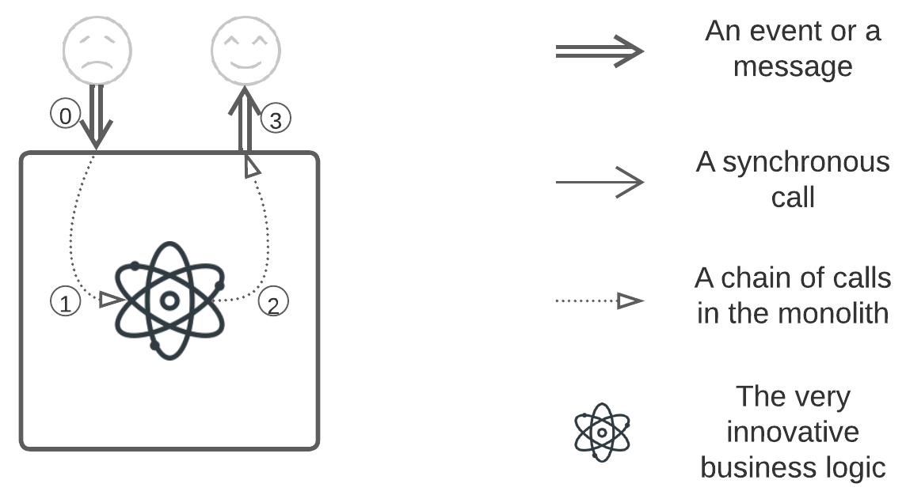
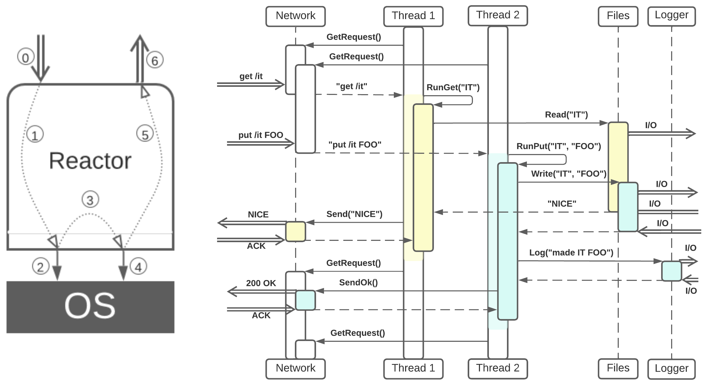
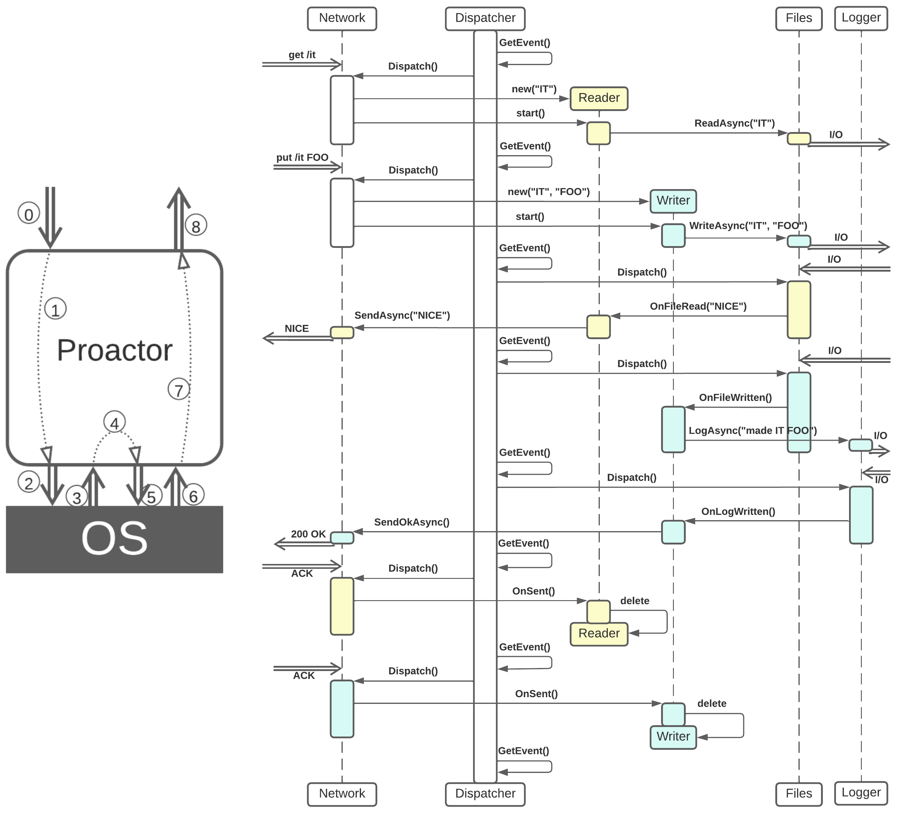
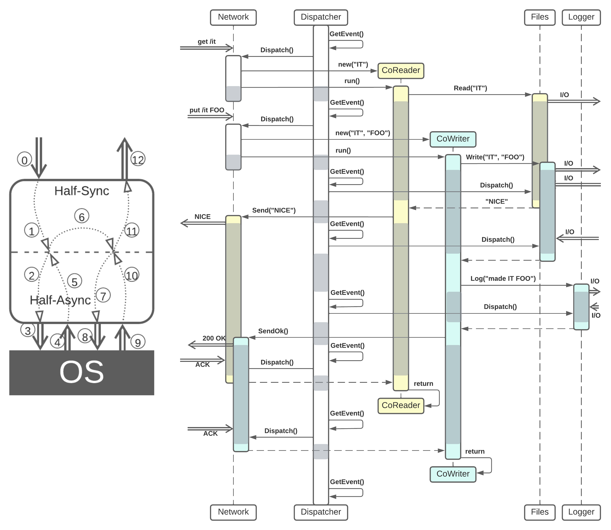
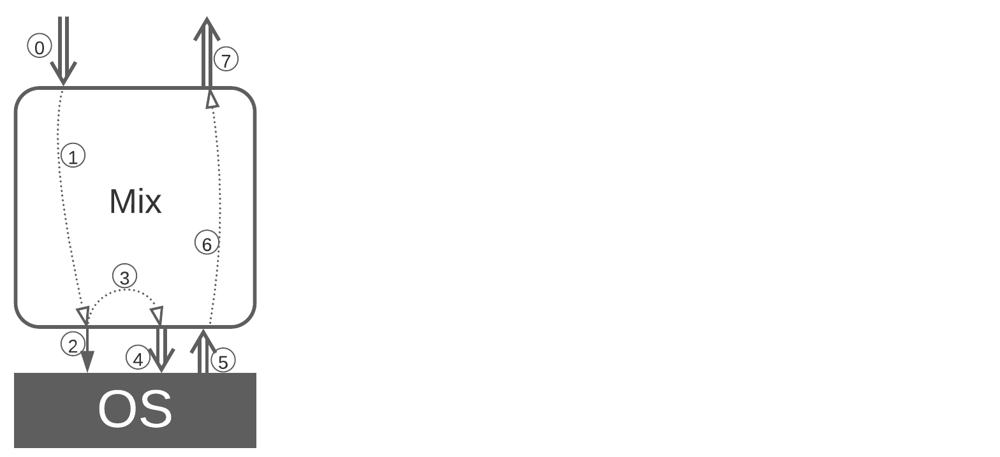

_[Part](../README.md)_ [1][Part 1] **2** [3][Part 3] [4][Part 4] [5][Part 5]

---

# Introduction to Software Architecture with Actors: Part 2 – On Handling Messages

After [defining actors][Part 1] and traversing the _design space_ [[POSA1](#POSA1), [POSA5](#POSA5)] for systems built of actors, it is time to look inside an actor to find out how it may work. However, first we’ll need to make a distinction between _control_ _flow_ and _data flow_.

- [Control Flow vs Data Flow](#control-flow-vs-data-flow)
- [Monolith](#monolith)
  - [Reactor (synchronous calls)](#reactor-posa2-synchronous-calls)
  - [Proactor (asynchronous messages)](#proactor-posa2-asynchronous-messages)
  - [Half-Sync/Half-Async (coroutine-based reactor)](#half-synchalf-async-posa2-coroutine-based-reactor)
  - [A mixed case](#a-mixed-case)
- [Request State](#request-state)
- [Summary](#summary)
- [References](#references)

## Control Flow vs Data Flow

All software processes incoming information to produce outgoing information.

If a piece of software does not produce anything, it serves no purpose. The information a piece of software works on can be either **_data_** (a sequence of signals in a hardware bus) or **_events_** (signals in a hardware bus coming at specific moments). The systems that process these two kinds of information have distinct properties.

Let’s compare a camera and a cell phone.

A camera exists to stream data from its matrix to either its display or a flash card. The process may be something like:

[Read from the matrix to the RAM] => [RGGB to RGB] => [Calculate statistics for the image] => [Apply brightness correction] => [Apply color correction] => [Apply noise reduction] => [Decrease the color depth] => (1: [Write to the LCD]) _or_ (2: [Write to the viewfinder]) _or_ (3: [Compress to JPEG] => [Write to the flash]).

Every frame the matrix captures takes this path, and the steps taken never depend on the frame itself. Some of the steps (_filters_) in the frame processing pipeline are optional (their application depending on the camera’s settings), but the pipeline is very stable – as the settings are seldomly changed – to the extent that hundreds if not thousands of frames pass through the same pipeline.

This was a description of **data flow**. The data passes through a static sequence of processing steps, as through a [meat grinder](https://youtu.be/HrxX9TBj2zY?t=49). 

Now, let’s consider a cell phone. A user pressing the “2” key results in one of the following actions:
* If an audio connection is established, a message with the dialed digit (“2”) will be sent to the radio frequency interface, and the DTMF feedback generator will be activated.
* If the cell phone’s display shows a text input screen, the last pressed key was “2”, and the last key event’s timestamp is more recent than the specified timeout, the last dialed symbol on the screen will change.
* Otherwise, if the cell phone’s display shows a text input screen, “A”, “a”, or “2” (depending on the software state), will be appended to the text on the screen.
* If the screen shows a menu, the second option on the menu will be activated.
* If the _Snake_ game is on the screen, the snake will turn upwards, unless it is already crawling upwards.
* If an alarm is active, its ringing will be delayed by 5 minutes.
* If the keypad is locked and there have been no recent key presses, animated instructions for unlocking the keypad will be shown.
* Otherwise, if the keypad is locked, nothing will happen.
* If the phone is powered off (or, rather, its CPU is running at a lower frequency, for phones never ever shut down entirely; they just wait for the power button to be pressed again), nothing will happen.

In addition to any of the events listed above, the tone generator will be activated if the “keypad tones” configuration option is enabled.

Here, a single event (pressing the “2” key) may cause various use cases or be completely ignored, based on the system’s current state. Some of the resulting actions may change the current state in such a way that the subsequent “2” key event will cause a totally different action. Even the activation of hardware modules depends on the current state of the software.

This is referred to as **control flow**. An event has no inherent meaning outside the current state of the system, which is decisive for choosing any (including void) reaction to the incoming message.

Of course, a camera has menus written in the _control flow_ style. It’s also true that every phone contains an audio path engineered for _data flow_. In fact, many real-life systems involve both paradigms, but just as the requirements for _control-_ and _data_-flow modules differ, so too do their architectures. While a camera may not respond to key presses while it is writing a picture to its memory card, a cell phone, as a real-time device, must allow its user to immediately stop a call in any situation (Yes, stopping a call is a complex, multi-step scenario that starts with pressing a key).

<table>
  <tr>
   <td>
   </td>
   <td><strong>Data Flow</strong>
   </td>
   <td><strong>Control Flow</strong>
   </td>
  </tr>
  <tr>
   <td><em>Aim</em>
   </td>
   <td>Processing a stream of data
   </td>
   <td>Reacting to events
   </td>
  </tr>
  <tr>
   <td><em>Efficiency as</em>
   </td>
   <td>Throughput
   </td>
   <td>Responsiveness
   </td>
  </tr>
  <tr>
   <td><em>Message propagation through the system</em>
   </td>
   <td>Similar for every message of a given type
   </td>
   <td>Usually differs between instances of an event
   </td>
  </tr>
  <tr>
   <td><em>Messages change the system’s state</em>
   </td>
   <td>Usually, no
   </td>
   <td>Usually, yes
   </td>
  </tr>
  <tr>
   <td><em>Interface length (number of types of incoming messages)</em>
   </td>
   <td>Narrow (a few to dozens)
   </td>
   <td>Wide (hundreds to thousands)
   </td>
  </tr>
  <tr>
   <td><em>Length of data payload per message</em>
   </td>
   <td>Usually long (data packet)
   </td>
   <td>Usually short (event notification)
   </td>
  </tr>
</table>

We are now ready to start reviewing the architectures themselves.

## Monolith

> _“Use case”, “scenario”, “request processing” and “task” will be used as synonyms for chains of steps that implement business logic rules._

> _These days, people refer to a set of components that need to be deployed together as a “monolith”, though the term, which was coined in the 1980s, had a distinctly different meaning prior to the proliferation of internet servers, and with them, the notion of "deployment". In spite of the fact that [[POSA1](#POSA1)] does not contain the term “monolith” itself, it uses “monolithic system”, “monolithic application” or “monolithic structure” as opposed to a loosely coupled (i.e. layered or distributed) system. Let’s reuse this old notion and call entities with no discernible structure **monoliths**. As the present cycle of articles centers on asynchronous systems, wherein components interact by sending messages, most synchronous services should be treated as monoliths for the duration of the discussion._

Monolith is the simplest structure, and is [recommended](https://martinfowler.com/bliki/MonolithFirst.html) [[MP](#MP)] for the following cases:
1. When working in a new domain that none in the team is experienced with (i.e, there is no sure way to split the project into loosely coupled parts), or
2. The project is unlikely to grow huge in any dimension (load, complexity, longevity) and
3. There are no special (real-time response, high availability) or conflicting non-functional requirements.

_Benefits:_
* The project gets a quick start (no heavy infrastructure; just go code the logic).
* It employs the simplest possible code structure (unless the project grows large). 
* It’s easy to debug.
* If anything crashes, everything crashes (so there’s no need to check for incomplete tasks, half-written data or unowned locks).
* Architectural decisions are delayed till the domain is better understood – this follows the saying that _the most important decisions somehow need to be done when one has the least information available_.
* The monolithic structure allows for the best optimizations on resource (CPU, RAM, drives, network) use.

_Drawbacks:_
* The entire application’s code is coupled; thus, it is impossible to vary properties (non-functional requirements [[MP](#MP)]) of parts of the system (subdomains or drivers).
* The code quality quickly deteriorates as time passes and requirements change (poor evolvability).
* If anything crashes, everything crashes (Users only have so much patience).

_Evolution_:
* If the business logic becomes unmanageable because of the project’s size, the monolith should be split into asynchronous _(Micro-)Services_, described in [Part 3]. This may also help with scalability.
* The business logic can be isolated from the underlying platform, transports and 3rd party libraries by applying _Layers_ (from [Part 3] of this series), followed by _Hexagonal Architecture_ (described in [Part 4]). This also has a limited positive effect on the project complexity and improves testability. Another good option is going for _Pipeline_ ([Part 3]), but that architecture only fits a specific subset of applications. 
* Scalability and fault tolerance are achieved firstly by _sharding_ ([Part 3]), with finer control being possible through the use of such granular architectures as _Pipeline_ ([Part 3]), _SOA_ ([Part 5]) or even _Nanoservices_ ([Part 3]).
* Contradictory non-functional requirements will lead to the fragmentation of the monolith into _Layers_ ([Part 3]), _Hexagonal Architecture_ ([Part 4]) and _Hexagonal Hierarchy_ ([Part 5]) or _(Micro-)Services_ ([Part 3]), probably over a _Shared Repository_ ([Part 4]), that may grow into a _Cell-Based Architecture_ ([Part 5]). Less common options include _Nanoservices_ ([Part 3]) and _SOA_ ([Part 5]).
* Customizability is achieved with _Plug-Ins_ or _Domain-Specific Language_ (both from [Part 4]). _Pipeline_ ([Part 3]) is also a good option if it fits the project’s domain.

It is noteworthy that the fact that “If anything crashes, everything crashes” is both a benefit and a drawback. Software architecture is all about making decisions with important benefits and ignorable drawbacks, while what exactly counts as important or ignorable depends on the project. That also holds true for the simplicity of software design – monoliths are easy to start coding, but as the project grows, they become hard to maintain and evolve. One should choose one’s method based on what is important now and what is expected to be important in the future. Everything has a cost.

_Common names_: **[Big Ball of Mud](https://martinfowler.com/bliki/MonolithFirst.html)**, Hello World, KISS + YAGNI.

_Software architecture_: **Reactor** [[POSA2](#POSA2)], Proactor [[POSA2](#POSA2)], Half-Sync/Half-Async [[POSA2](#POSA2)].

_System architecture_: **Monolith**.

Basically, any unstructured (for the current discussion, meaning “not divided by asynchronous interfaces”) code belongs here. This is usually good (simple and stupid) for a small amount of code without any special requirements.

Handling an incoming request/event triggers a chain of data processing operations (_data flow_) or a choice of reactions (_control flow_) that can be implemented as either _Reactor_ or _Proactor_, which can also be mixed in a couple of ways (as is common with software architecture).

### Reactor [[POSA2](#POSA2)] (synchronous calls)

> _(Parallel use cases are shown in colors)_

**_A thread per task – imperative programming._** Every incoming request is served by a dedicated (for the duration of processing the request) thread, every call out of the _reactor_ (to the OS, over the network or into libraries) is blocking. Typically, multiple request handling threads are used (e.g. _Leader/Followers_ [[POSA2](#POSA2)] or _Thread Pool_ (_Master-Slave_ [[POSA1](#POSA1)]), both discussed in [Part 3]). Multithreaded reactors have to protect their state with mutexes, are indeterministic and may be considered the default approach for_ data-flow_-dominated systems (naive backend implementation). The basic request processing code is simple, but it is [hard](https://hillside.net/plop/2020/papers/poltorak.pdf) for one of the request processors to influence others (i.e., to cancel or edit a running request). Thus, a multithreaded reactor is a kind of simplistic _sharding_ (to be discussed in [Part 3] of the publication).

_Benefits:_
* The code for use cases is simple.
* Debugging is easy.

_Drawbacks (common):_
* There is no multicast support (It’s impossible to send several outgoing requests in parallel, unless one goes through the trouble of implementing promises).

_Drawbacks (single-threaded variation):_
* The throughput is low – only one request is being processed at any given moment.

_Drawbacks (multi-threaded variation):_
* The system is indeterministic, making it impossible to reproduce bugs or restore the reactor’s state by replaying the incoming requests.
* Threads use much resources and are quite slow to switch.
* If the reactor has a mutable state, it should be protected with mutexes, sometimes resulting in performance degradation or even deadlocks.
* Tasks cannot easily interact.

Though multithreaded reactors are common for backends, [hardware](http://ithare.com/chapter-vd-modular-architecture-client-side-client-architecture-diagram-threads-and-game-loop/) and [database](http://ithare.com/multi-coring-and-non-blocking-instead-of-multi-threading-with-a-script/3/) adapters often need to be single-threaded in order to both protect the managed device from conflicting requests and optimize its performance. In that case, the reactor blocks for the duration of the hardware’s processing of the request, and as soon as it gets a response from the hardware, the reactor proceeds with accepting and running the next request for the wrapped device.

### Proactor [[POSA2](#POSA2)] (asynchronous messages)

**_Multitasking without multithreading – reactive programming._** A single thread handles all the events: the incoming requests and the responses from the underlying hardware or libraries. All the outgoing communication is asynchronous (even reading/writing to HDDs); thus, the thread never blocks, every event is processed extremely quickly, the single thread is enormously productive and responsive, and resource usage stays low. It is even possible to keep the proactor thread warm (busy waiting on the event queue) to improve the response time. The proactor’s state does not need to be protected by mutexes (as there is only one thread inside the proactor).

As incoming events are serialized by the actor’s event queue, any request at any processing stage may change the proactor’s state, thereby [influencing the behavior](https://hillside.net/plop/2020/papers/poltorak.pdf) of all the subsequent events, including the events involved in parallel tasks. The execution is [deterministic](http://ithare.com/multi-threading-at-business-logic-level-is-considered-harmful/) – if incoming messages are recorded, it is possible to replay them later to reproduce bugs or restore the state of the proactor in case of hardware failures (_event sourcing_ [[MP](#MP), [DDIA](#DDIA)]).

All the benefits come at a price: the code for every use case is [dispersed](https://hillside.net/plop/2020/papers/poltorak.pdf) over multiple asynchronous event handlers, making use cases very hard to understand and/or debug – it’s the dark side of reactive programming.

The approach is good for _control flow_, when it is important to govern system state and make changes in real time to scenarios that are already running. The drawback of being limited to a single CPU core is usually unimportant for control flow logic, as no big data processing is involved. It is also quite natural for control-flow-dominated systems not to have explicitly coded use cases (as there are so many possible interrupts or branches that any imperative programming attempts turn into a nightmare), in which case there is not much to lose in code structure.

_Proactor_ is opposed to _Reactor_: Reactor has simple business logic code, but it is unresponsive and RAM-heavy if multithreaded. Proactor, on the other hand, sacrifices the readability of business logic for flexibility, real-time responsiveness and low resource consumption.

_Benefits:_
* Tasks may easily influence each other during execution via the actor’s state.
* There are no thread context switches, leading to maximal responsiveness.
* The resource (CPU, RAM) consumption for each running task is minimal, which maximizes the number of requests that can be processed in parallel.
* The system is deterministic, which means that [bugs are reproducible](http://ithare.com/deterministic-components-for-interactive-distributed-systems-with-transcript/).
* Multicasting is natural – any step of request processing may send out several requests in parallel, with response handlers collecting the data and continuing the task as soon as all the data is available.

_Drawbacks:_
* Use cases gain extremely ugly code and are hard to debug. The source code is grouped by messages (including responses from the periphery) it handles, not by scenarios of business logic.
* A single CPU core is used. It is possible to run a proactor multithreaded, but doing so will devoid the actor of most of the proactor’s benefits.

### Half-Sync/Half-Async [[POSA2](#POSA2)] ([coroutine-based reactor](http://ithare.com/multi-coring-and-non-blocking-instead-of-multi-threading-with-a-script/2/))

> _(The periods of time when the CPU serves another stack are grayed out)_

The upper half contains multiple _reactors_ (implemented by threads or coroutines) which block on calls to the underlying _proactor_. The proactor’s thread serves events from the system (OS, libs) and may also serve the calls from the reactors, acting as an RPC implementation layer. The system as a whole represents a middle ground between Reactor and Proactor; hence its description being placed alongside them.

> _Half-Sync/Half-Async is, in actuality, Layers plus Sharding (both of which are approached in [Part 3] of the publication) or, rather, a kind of Microkernel (from [Part 4]). However, as it is used for message handling, it is discussed here._

**_Multithreading without multithreading – imperative tasks over a reactive engine._** When implemented with coroutines (a _coroutine_ is a call stack that does not own an execution thread), _Half-Sync/Half-Async_ keeps the benefits of single-threaded actors, namely: determinism and low resource consumption. In this case, a single execution thread switches between its original stack in the lower (proactor) half and multiple coroutine (reactor) stacks of tasks running in the upper half. Every incoming request is turned into an upper-half coroutine and run as a synchronous (blocking) chain of calls in the actor’s single thread. However, any blocking call from the synchronous scenario yields the thread to the lower non-blocking half instead of going into the OS kernel. And when the lower half gets a response from the OS to a request running on behalf of one of the upper half’s coroutines, it yields the execution thread to the coroutine in what looks like a return from a blocking call. Thus, _Half-Sync/Half-Async_ kind of reimplements OS threads, a runtime and a scheduler in user space.

_Benefits (for a single-threaded coroutine-based implementation):_
* The code in use cases is simple.
* Debugging is easy.
* Context switching is relatively cheap.
* There is relatively low RAM consumption per running request.
* The system is deterministic, which means [bugs are reproducible](http://ithare.com/deterministic-components-for-interactive-distributed-systems-with-transcript/) with event replay.
* A task may cancel other tasks by throwing exceptions into their (blocked) call stacks.

_Drawbacks:_
* A complex infrastructure code is needed to support the coroutines engine.
* A task can usually only cancel other running tasks, not change their behavior, as the tasks are written in the active (imperative) paradigm.
* A single CPU core is normally used. It is possible to utilize multiple threads; however, doing so will lead to indeterminism, the need to protect shared resources, and possible troubles with inter-task interactions.
* Multicasting is not easy (as it requires some dedicated code in the async layer).
* Coroutines may not be supported with older compilers or exotic hardware.

> _Here we have yet another notion that haunts us throughout this cycle of publications: if there are two options, there’ll usually be a third one holding the middle ground, featuring some of the benefits of both but often being quite complex to implement. This is on top of the trouble that stems from many architectural patterns potentially being considered special cases of other patterns, generalizations of third ones, or combinations of several fourths and fifths, which is further complicated by the fact that most of them are known by quite a few unrelated names._

_Half-Sync/Half-Async_ is more complex than both _Reactor_ and _Proactor_, but it may still be a good choice for larger projects if the costs of implementing and supporting the async infrastructural layer are offset by lowering the resource consumption of _Reactor_ without losing the simplicity of the synchronous business logic. This is similar to RPC’s status as an adapter between procedural synchronous calls and reactive asynchronous messaging.

### A mixed case

Some outgoing requests (like writing to an SSD or communicating over Thunderbolt) are quick and blocking, while others are asynchronous. Combining blocking and non-blocking calls has been [described](http://ithare.com/multi-coring-and-non-blocking-instead-of-multi-threading-with-a-script/2/) as an optimization that minimizes the amount of context switching and simplifies the high-level code. The same approach often seems to be used in microservice systems, where communication between a microservice and its database may be synchronous while the microservices send asynchronous messages to each other.

## Request State

Every request processing method uses RAM to store the task’s _state_ (progress and data):
* With a (multi-threaded) _Reactor_, the request’s state resides on the stack of the thread that processes the request. This makes it impossible for requests to influence each other, as the stack structure is opaque (OS-dependent). In many cases, the detriment that arises as a result of high resource consumption by multiple threads is balanced out by the fact that the code for business logic (tasks) is easy to read and debug, being written in the imperative style.
* With a (single-threaded) _Proactor_, everything is stored as explicit data structures in the actor’s state, together with the actor’s own static variables. This makes it easy for one task to access the states of other tasks. Moreover, as every step of a task starts as a callback from an event handler, a task must explicitly read and check its own state at every step; thus, there is no way it will miss the changes to its state made by some other task. It’s paid for with the fragmented business logic code characteristic of reactive programming. 
* There is an intermediate case for a (single-threaded) coroutine-based _Half-Sync/Half-Async_: the states of tasks reside on call stacks (like with _Reactor_), but the programming language-dependent coroutine runtime provides ways to interact with blocked coroutines. The business logic code is simple, though it comes at the cost of the complex extra infrastructure layer that reimplements the functions (thread scheduling, blocking calls over async I/O), which are normally provided by the OS.

## Summary

* The difference between _data flow_ and _control flow_ was identified.
* The most common approaches to request processing were analyzed in detail.
* The interplay between the ways request states are stored, the possibility of running requests to interact and the complexity of business logic code were hinted at.

In the [subsequent installments][Part 3], we’ll investigate the ways to split a monolith by asynchronous interfaces (or to assemble a system from several monoliths).

## References

<a name="DDIA"/>

[DDIA] Designing Data-Intensive Applications: The Big Ideas Behind Reliable, Scalable, and Maintainable Systems. _Martin Kleppmann. O’Reilly Media, Inc. (2017)._

<a name="MP"/>

[MP] Microservices Patterns: With Examples in Java. _Chris Richardson._ _Manning Publications (2018)_.

<a name="POSA1"/>

[POSA1] Pattern-Oriented Software Architecture Volume 1: A System of Patterns. _Frank Buschmann, Regine Meunier, Hans Rohnert, Peter Sommerlad and Michael Stal. John Wiley & Sons, Inc. (1996)._

<a name="POSA2"/>

[POSA2] Pattern-Oriented Software Architecture Volume 2: Patterns for Concurrent and Networked Objects. _Douglas C. Schmidt, Michael Stal, Hans Rohnert, Frank Buschmann. John Wiley & Sons, Inc. (2000)._

<a name="POSA5"/>

[POSA5] Pattern Oriented Software Architecture Volume 5: On Patterns and Pattern Languages. _Frank Buschmann, Kevlin Henney, Douglas C. Schmidt_. _John Wiley & Sons, Ltd. (2007)._

---

_Editor:_ [Josh Kaplan](mailto:joshkaplan66@gmail.com)

_[Part](../README.md)_ [1][Part 1] **2** [3][Part 3] [4][Part 4] [5][Part 5]

---

 This work is licensed under a <a rel="license" href="http://creativecommons.org/licenses/by-nc-sa/4.0/">Creative Commons Attribution-NonCommercial-ShareAlike 4.0 International License</a>.

[Part 1]: ../Part1/README.md
[Part 3]: ../Part3/README.md
[Part 4]: ../Part4/README.md
[Part 5]: ../Part5/README.md